# Cinestation 使用文档

Cinestation是Cocos 3.3.x上的一个可视化智能相机系统，它具备智能追踪，优先级控制，轨道移动，噪声控制，时间轴动画等等功能，支持配置任意数量的镜头，完成复杂的相机混合和运动效果。

## [演示视屏](https://www.bilibili.com/video/BV12R4y147zf?spm_id_from=333.999.0.0)
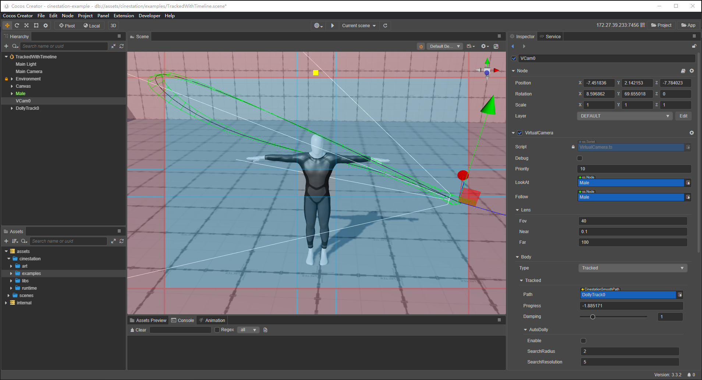

## 目录

1. [入门](#入门)
    1. [安装](#安装)
    2. [运行示例](#运行示例)
2. [虚拟相机(VirtualCamera)](#虚拟相机(VirtualCamera))
    1. [创建并运行](#创建并运行)
    1. [通用参数](#通用参数)
    2. [机体参数(Body)](#机体参数(Body))
    3. [目标参数(Aim)](#目标参数(Aim))
    4. [噪声参数(Noise)](#噪声参数(Noise))
3. [相机大脑(CinestationBrain)](#相机大脑(CinestationBrain))

## 1. 入门
### 1.1. 安装
1. Cinestation要求的最低运行环境是Cocos 3.3.0，请确保你使用的引擎高于此版本

2. 从Cocos Store下载插件，并安装到项目的扩展包路径中： $你的项目地址/extensions

3. 重启编辑器等待插件加载完成，assets下出现了一个cinestation的文件夹，安装成功

> 如果你发现编辑器资源刷新报错，重启下编辑器就可以了

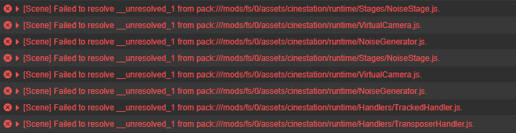

### 1.2. 运行示例
在编辑器中打开cinestation/examples文件夹，里面有各个功能的示例。

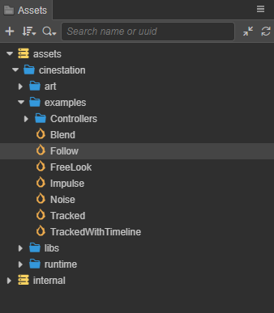

> 如果运行示例时报下图的错误，请检查下工程配置，3D是不是没有打开，全部勾上即可

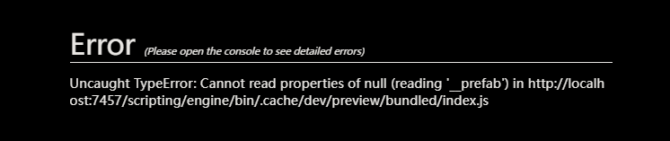

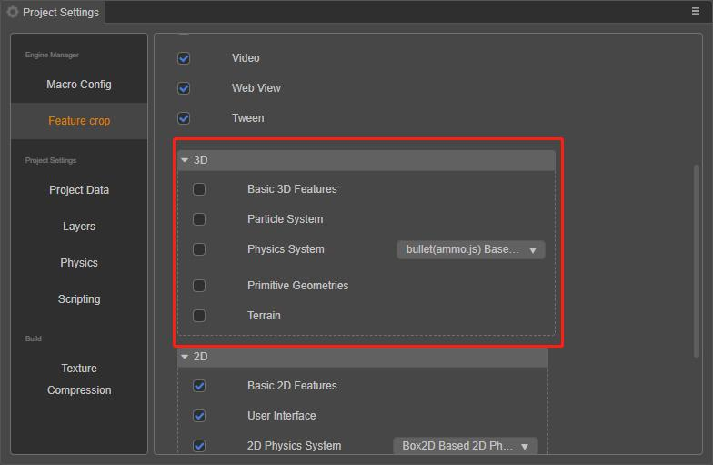

## 2. 虚拟相机(VirtualCamera)
### 2.1. 创建并运行
选择Extension->Cinestation->VirtualCamera

拖拽目标对象到LookAt，运行。

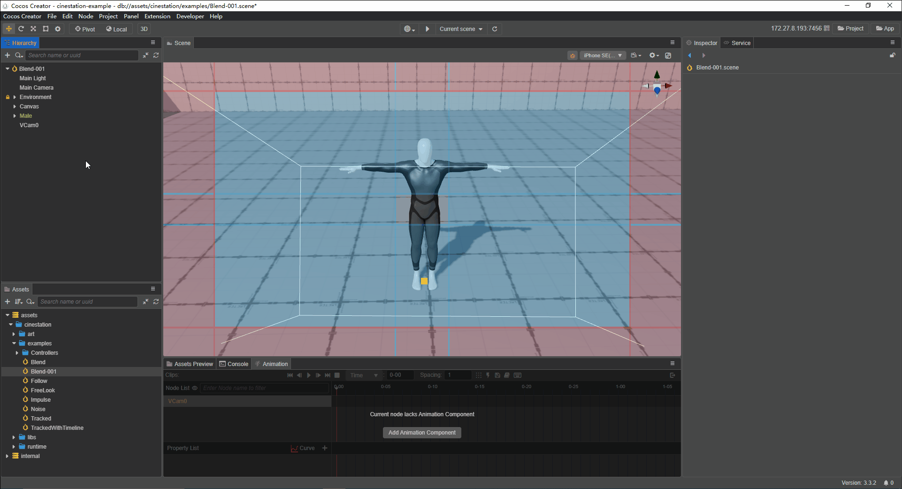

### 2.2. 通用参数
| 参数     | 说明                                           |
|----------|------------------------------------------------|
| Debug    | 在运行时显示死区和软区                         |
| Priority | 虚拟相机优先级，数值越大优先级越高，默认值是10 |
| LookAt   | 瞄准目标                                       |
| Follow   | 跟踪目标                                       |

### 2.2. 机体参数(Body)
### 2.2.1. FreeLook
自由相机，你可以自由的操作虚拟相机进行旋转、平移、推进。

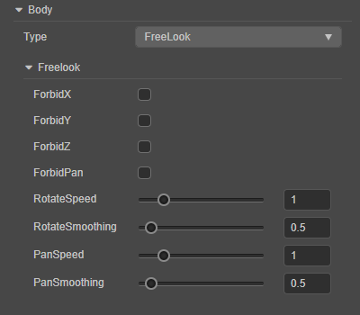

| 参数            | 说明                               |
|-----------------|------------------------------------|
| ForbidX         | 禁止水平方向旋转                   |
| ForbidY         | 禁止垂直方向旋转                   |
| ForbidZ         | 禁止相机推移                       |
| ForbidPan       | 禁止相机平移                       |
| RotateSpeed     | 旋转速度                           |
| RotateSmoothing | 旋转平滑系数。数值越大旋转惯性越大 |
| PanSpeed        | 平移速度                           |
| RotateSmoothing | 平移平滑系数。数值越大平移惯性越大 |

### 2.2.2. Tracked
轨道相机，虚拟相机沿着用户给定的路径(Path)移动。
启用AutoDolly，虚拟相机会自动移动到路径上距离Follow目标最近的位置。

| 参数                       | 说明                                                                |
|----------------------------|---------------------------------------------------------------------|
| Path                       | 相机移动的路径。此属性必须是CinestationSmoothPath                   |
| Progress                   | 移动进度。 数值0表示第一个位置点，数值1表示第二个位置点，以此类推。 |
| Damping                    | 移动阻尼系数。数值越大跟踪移动越慢                                  |
| AutoDolly/Enable           | 开启自动定位                                                        |
| AutoDolly/SearchRadius     | 当前位置两侧搜索的片段数量。 数值为0时，搜索整个路径                |
| AutoDolly/SearchResolution | 将轨道分成多个片段来搜索。数值越大，结果越精确，性能消耗也越大      |

### 2.2.3. Transposer
跟踪相机，虚拟相机将一直与Follow目标保持一定的位移。

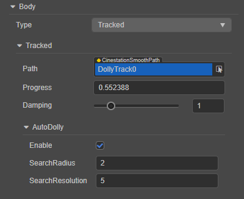

| 参数          | 说明                                         |
|---------------|----------------------------------------------|
| FollowOffset  | 与Follow目标之间的位移，初始值为(0,0,-10)    |
| FollowDamping | 跟随阻尼系数。数字越小相机越灵敏，越大越迟顿 |

### 2.3. 目标参数(Aim)
### 2.3.1. Composer
虚拟相机朝向LookAt目标，并让目标保持在死区内。

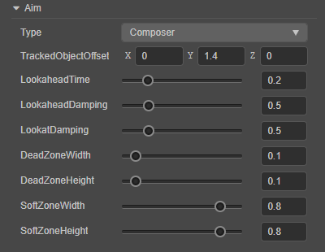

| 参数                | 说明                                                                                      |
|---------------------|-------------------------------------------------------------------------------------------|
| TrackedObjectOffset | 从LookAt目标的中心作局部空间的位置偏移。 所需区域不是跟踪目标的中心时，微调跟踪目标的位置 |
| LookaheadTime       | 根据LookAt目标的运动动态调整偏移量。预估了目标将在未来几秒内出现的位置                    |
| LookaheadDamping    | 控制预估的阻尼系数。数值越大阻尼越强，预测越滞后，可以消除因为预测带来的抖动              |
| LookatDamping       | 瞄准目标的阻尼系数。数值越小，可以更快的将目标保持在死区，数值越大，瞄准速度越慢。        |
| DeadZoneWidth       | 死区宽度。如果目标在死区内，相机则不会旋转                                                |
| DeadZoneHeight      | 死区高度。如果目标在死区内，相机则不会旋转                                                |
| SoftZoneWidth       | 软区宽度。如果目标在软区内，相机将在lookatDamping指定时间内旋转到死区                     |
| SoftZoneWidth       | 软区高度。如果目标在软区内，相机将在lookatDamping指定时间内旋转到死区                     |

### 2.3.2. HardLookAt
虚拟相机朝向LookAt目标, 并让目标保持在屏幕中心。

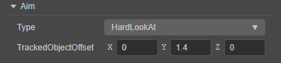

| 参数                | 说明                                                                                      |
|---------------------|-------------------------------------------------------------------------------------------|
| TrackedObjectOffset | 从LookAt目标的中心作局部空间的位置偏移。 所需区域不是跟踪目标的中心时，微调跟踪目标的位置 |

### 2.4. 噪声参数(Noise)
给虚拟相机添加噪声偏移，模拟一些特定的环境。

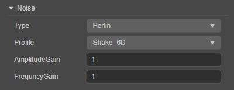

| 参数          | 说明                                 |
|---------------|--------------------------------------|
| Type          | None: 没有噪声，Perlin: 柏林噪声     |
| Profile       | 多种预置噪声参数                     |
| AmplitudeGain | 幅度增益。数值越大相机晃动幅度越明显 |
| FrequencyGain | 频率增益。数值越大相机晃动频率越高   |

## 3. 相机大脑(CinestationBrain)
虚拟相机的总控制单元。必须挂载在主相机(MainCamera)上。

| 参数  | 说明                                                 |
|-------|------------------------------------------------------|
| Style | Linear: 线行插值。目前仅支持线行插值，后续会支持更多 |
| Time  | 切换时间。数值为0时，为直接切换                      |